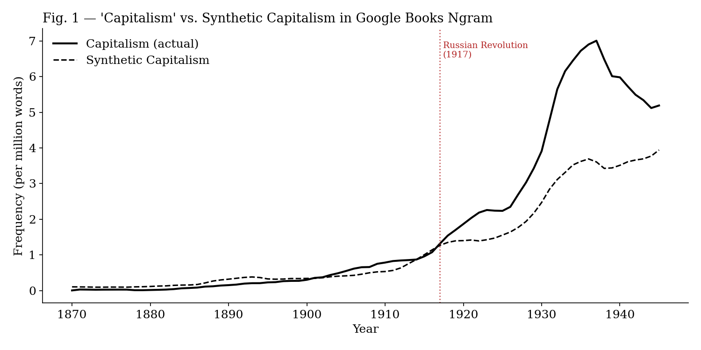

# Synthetic Capitalism

An evening SCM exercise that got out of hand.

## What this is

I was reading Magness & Makovi (2023), *"The Mainstreaming of Marx: Measuring the Effect of the Russian Revolution on Karl Marx's Influence,"* Journal of Political Economy, vol. 131, no. 6. It's a real paper, published in a top-5 economics journal, that uses Google Ngram data and the synthetic control method to argue that Marx's academic influence was artificially inflated by the 1917 Russian Revolution.

I wanted to practice SCM on real data. This seemed like a good excuse. I had a few beers. One thing led to another.

I also noticed that if you run the identical procedure — same treatment year, same data source, same method — but swap "Karl Marx" for "capitalism," you get a similarly interesting result.

We find a significant treatment effect, meaning that capitalism's academic stature today owes a substantial debt to political happenstance. Our findings nonetheless suggest that capitalism's modern intellectual prominence must be reconciled with the essential historical role of the Soviet Union in elevating capitalist doctrine. SCM thereby provides a plausible means of causally inferring a counterfactual historical scenario in the absence of treatment.

*(The preceding paragraph is composed entirely of sentences from Magness & Makovi (2023), with "Marx" replaced by "capitalism" and "Marxist" replaced by "capitalist." No other changes were made.)*

Which either means (a) the Russian Revolution was simultaneously history's most effective Marxist and libertarian propaganda event, or (b) Google Ngram frequencies go up after major geopolitical events and a synthetic control will dutifully confirm whatever hypothesis you point it at.

I personally lean toward (b).

## What this is not

- A peer-reviewed paper
- A serious methodological contribution
- As rigorous as the authors who got Synth Marx through JPE referees (respect to the hustle, genuinely)
- An attack on SCM as a method — SCM is great, this is about applying it to word counts in books and calling it causal inference

## The setup

| | Magness & Makovi (2023) | This notebook |
|---|---|---|
| **Treated unit** | Karl Marx | capitalism |
| **Treatment** | Russian Revolution, 1917 | Russian Revolution, 1917 |
| **Data** | Google Ngrams, English, and some other languages | Google Ngrams, English |
| **Method** | Synthetic Control | Synthetic Control |
| **Post-window** | 1917–1932 | 1917–1945 |
| **Donors** | Lassalle, Rodbertus, Oscar Wilde, Abraham Lincoln, Pasteur, Kelvin, Proudhon | a bunch of -ism's |
| **Conclusion** | Revolution mainstreamed Marx | Revolution mainstreamed capitalism |

Yes, that donor pool is real. Synthetic Marx is 12% Oscar Wilde, 5% Abraham Lincoln and 0.6% Lord Kelvin. The algorithm determined that a Victorian playwright, a US president, and a thermodynamics physicist are ingredients for the counterfactual history of socialist political economy. We do not dispute this. We simply note it.

<div align="center">


*Picture unrelated. The gun isn't the problem. The monkey is. This statement is also unrelated.*

</div>

The post-treatment window ends at 1945 to avoid the confounding effects of post-WWII Marshall Plan discourse — a rationale we consider at least as plausible as Magness & Makovi's decision to stop at 1932 to avoid the Nazi-era academic diaspora.

## Results

Capitalism diverges sharply from Synthetic Capitalism after 1917, reaching roughly 2× the counterfactual frequency by the mid-1930s. The pre-treatment fit is decent. There is a mild pre-treatment trend which we handle the same way Magness & Makovi handle theirs.



## Running it

```bash
pip install requests pandas numpy scipy matplotlib jupyter
jupyter notebook synth_apple.ipynb
```

No special packages. Data is fetched live from the Google Ngrams JSON API.

## Reference

Magness, Phillip W., and Michael Makovi. "The Mainstreaming of Marx: Measuring the Effect of the Russian Revolution on Karl Marx's Influence." *Journal of Political Economy* 131, no. 6 (2023): 1543–1574.
